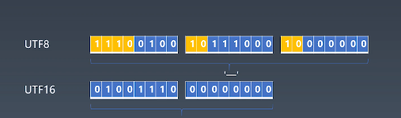

# String

- Character
- Code Point
- Encoding

# 编码

- ASCII
- Unicode
- UCS
- GB
  - GB2312
  - GBK(GB13000)
  - GB18030
- ISO-8859
- BIG5

# utf8 与 utf16

- UTF8 第一位是控制位，比如 `1110` 表示总共三位，黄色字符都是控制位，后两个字符控制位都是 `10` 开头

- UTF16 现在也有控制位了
