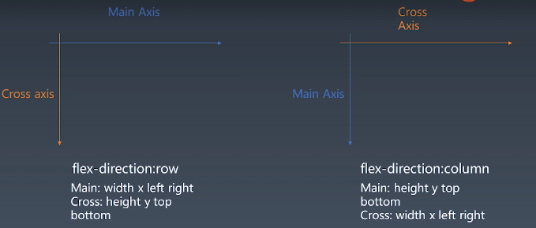
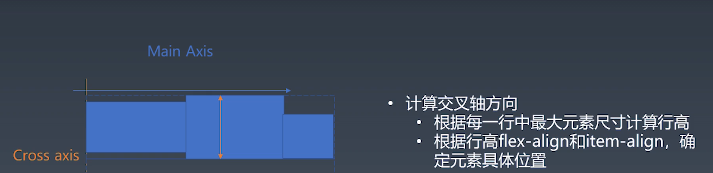

# 知识点

## 排版的代数

- 第一代: 正常流。包括了 position , display，float等一系列的属性。比较接近古典的排版的策略。
- 第二代: flex。比较接近人类的自然思维，比如填满剩余空间等等。比较接近设计软件的一些思维模式。
- 第三代: grid。更强大的排版模式
- 第四代：CSS Houdini 隐隐的感受到了第四代的味道

## 主轴与交叉轴

- 主轴 Main Axis
- 交叉轴 Cross Axis

- 当方向是 row时，

  - 主轴的属性是： width x left right   横向
  - 交叉轴的属性是： height y top bottom 竖向
- 当方向是 column时

  - 主轴：height y top bottomx left right
  - 交叉轴：width x left right
- ailgin-items和aligin-self 是控制交叉轴的对齐
- justify-content 控制主轴所有 flex 项目的对齐
- align-content: 控制多条主轴的 flex项目在交叉轴的对齐

# 步骤

## 1. 根据浏览器属性进行排版

- 处理了flexDirection 和 wrap 相关的属性。
- 把具体的 width height left top right bottom 抽象成了 main cross相关的属性

## 2. 收集元素进行（hang）

- 换行

## 4. 计算交叉轴

